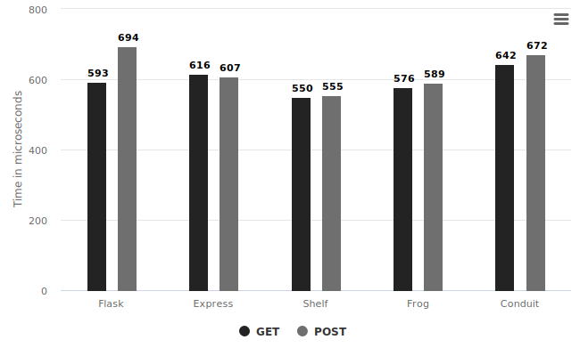
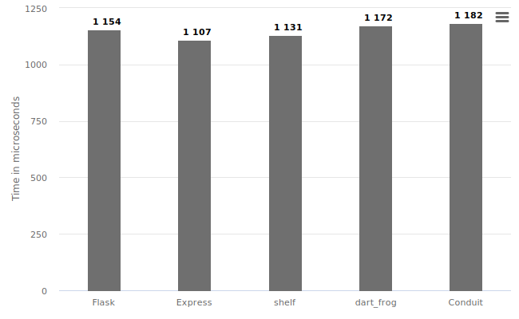
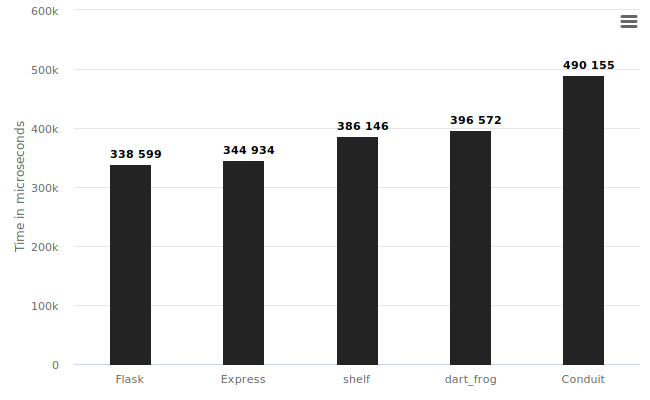
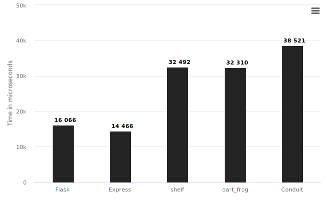

# Backend Benchmarking

It benchmarks RTT (Round trip time) - sequential and parallel, file upload and JSON parsing time in milliseconds for [Python (Flask)](https://flask.palletsprojects.com/en/2.2.x/), [Node (Express)](https://expressjs.com/), [Dart (shelf)](https://pub.dev/packages/shelf), [Dart (conduit)](https://j4qfrost.gitbook.io/conduit/) and [Dart (dart_frog)](https://dartfrog.vgv.dev/).

Please [open](https://github.com/SirusCodes/backend_benchmark/issues/new) an [issue](https://github.com/SirusCodes/backend_benchmark/issues/new) if you find any issues in the benchmarks.

> Check README.md for specific backends to see how to run them.

## How to test

1. Run the backend
2. Run benchmark
3. Note the results

# Benchmark

I got the below results by running the benchmark and servers on an AWS t3a.small instance running Ubuntu 22.

The benchmarks are testing backends on 4 bases

1. Synchronous request handling
2. Asynchronous request handling
3. Multi-part requests (File upload)
4. JSON parsing

> Lesser means better

## Synchronous request handling

In this, the client sends a request to the server then waits for the response and then sends another.

The lowest time taken was by Shelf which is still comparable with other frameworks

## Asynchronous request handling

In this multiple requests are sent to the server and waits for all the responses back from the server.

### GET requests

The fastest one was ExpressJS but again with not a great margin.

### POST requests

Here Flask is the fastest and Dart servers perform a bit slower and conduit is the slowest of all.

## Multi-part requests (File upload)

The multipart requests are usually made to upload images to a server. In this, I'm sending requests synchronously.

The Dart servers are handling it very slowly. Flask and ExpressJS are killing it.

dart_frog doesn't support it yet, you can track the progress at [dart_frog#296](https://github.com/VeryGoodOpenSource/dart_frog/issues/296).

The Shelf also doesn't provide out-of-the-box support for it but I have used [shelf_multipart](https://pub.dev/packages/shelf_multipart) (a 3rd party package) to handle requests.

## JSON parsing

In this, I'm stress testing the speed of JSON parsing by frameworks. By sending 1.04MB of JSON data over POST request synchronously.

Again you can see Flask and express are twice as fast as Dart frameworks.

> In real world no one will be sending such huge chunks of JSON over the network but these are just for benchmark sake
