# Backend Benchmark

Currently, it benchmarks backends in two ways.

1. Custom script to target specific cases
   1. Sequential requests (GET/POST)
   2. Multiple parallel requests (GET/POST)
   3. File upload (Multipart Requests)
   4. JSON parsing
2. Load testing by [k6]

Below are the results for both

## Specific stress test

|                                                                                    |                                                                           |
| ---------------------------------------------------------------------------------- | ------------------------------------------------------------------------- |
| 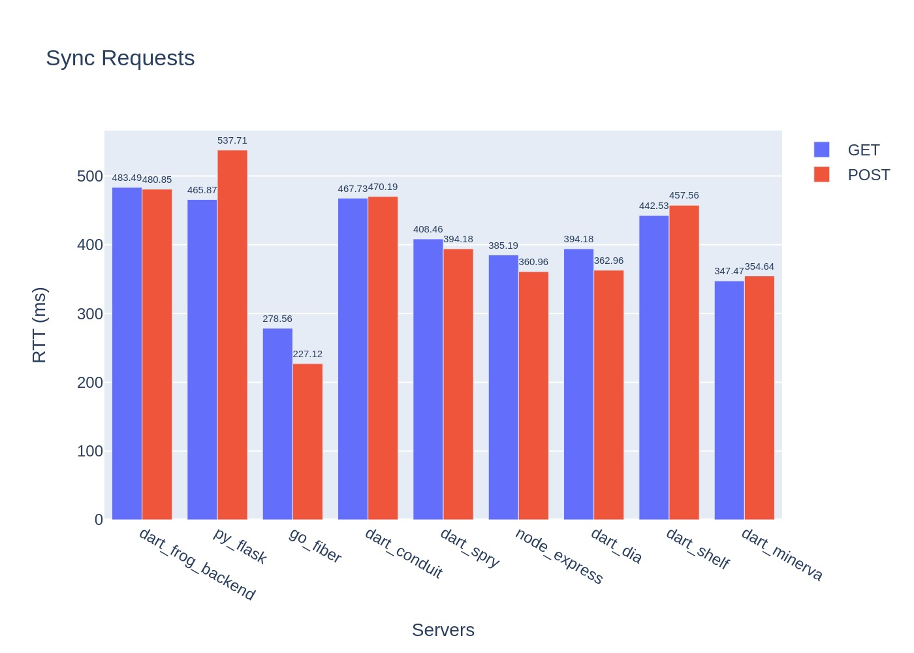                        | 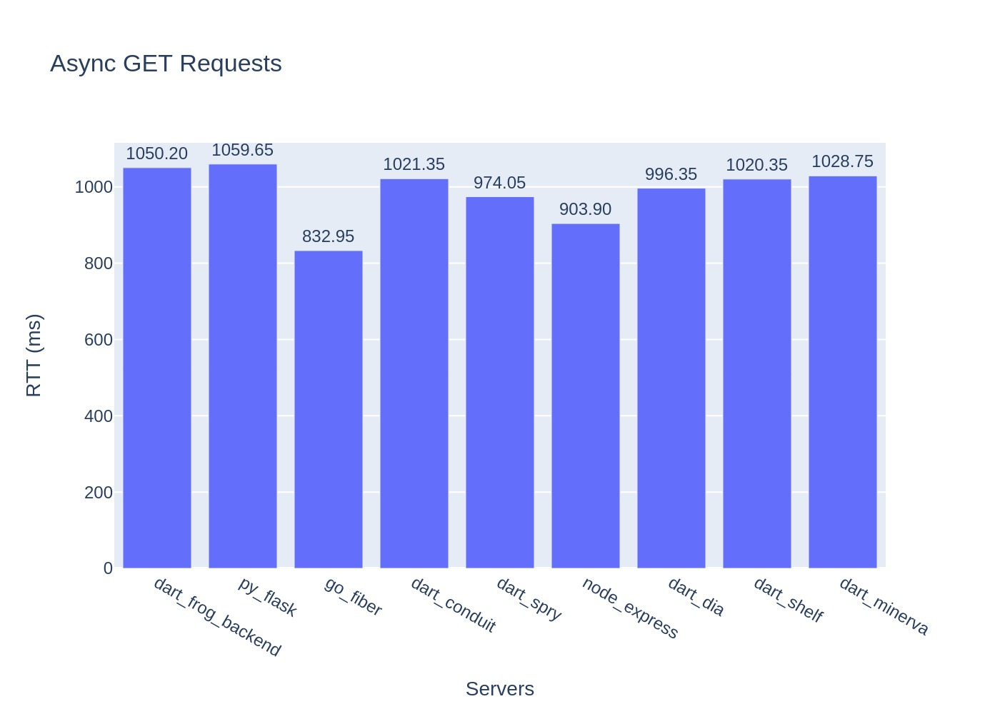 |
| Send one request at a time                                                         | Send multiple GET request at a time                                       |
| 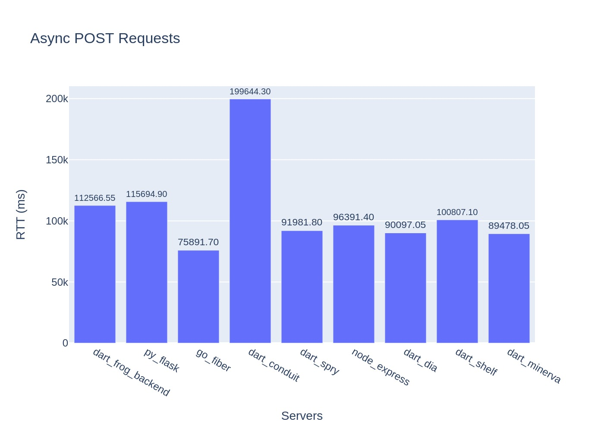        | 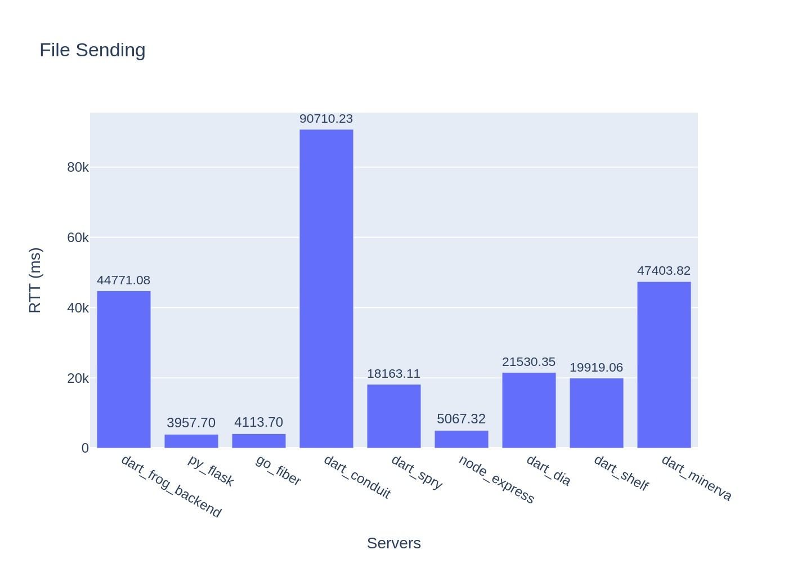           |
| Send multiple POST request at a time                                               | Send files with multipart                                                 |
| 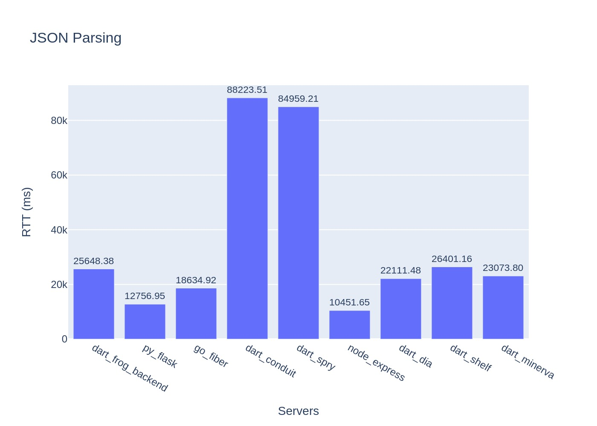 |                                                                           |
| Send 1.04MB of JSON to server and let it parse it                                  |                                                                           |

## Load testing

You can have a look at the [config file](https://github.com/SirusCodes/backend_benchmark/blob/main/scripts/k6_load_testing.js) on how it works.

A **TL;DR** would be it simulates the user increasing from 0 to 50, staying there for a minute then increasing to 100 and so on till it reaches 200 in step 50 and then decreases in step 100 till it reaches 0.

In the graphs below the _**Red line**_, represents the number of **virtual/simulated users** and the _**Blue line**_, represents the **Average round trip time (ms)** on the **Y-axes** and the **time for test** on **X-axis**.

### Conduit (Dart)

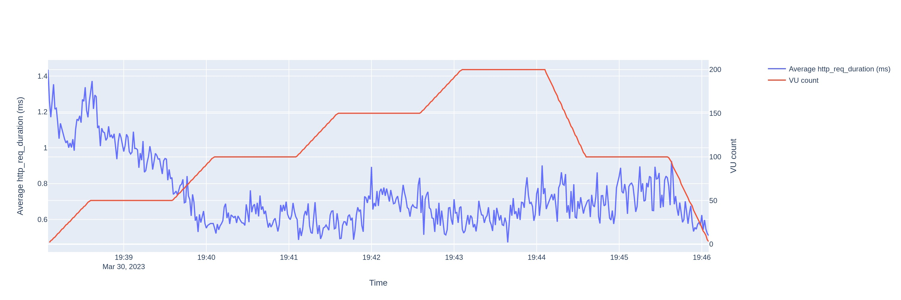

### Dia (Dart)

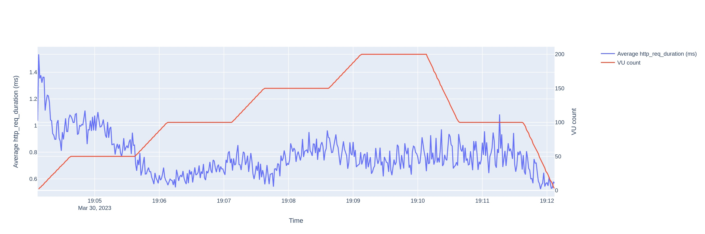

### dart_frog (Dart)

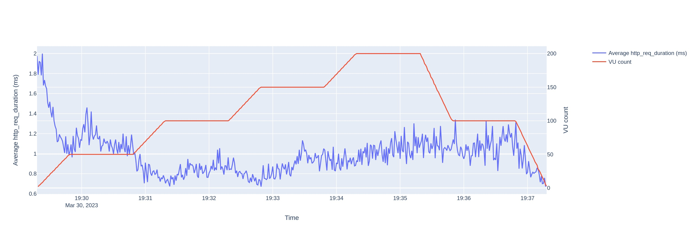

### minerva (Dart)

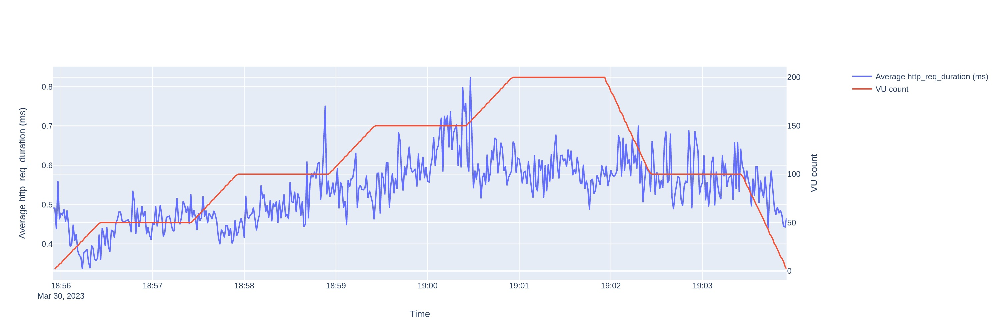

### shelf (Dart)

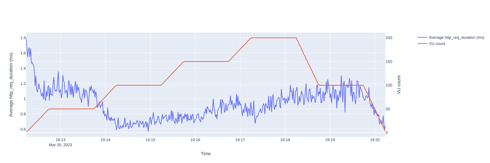

### spry (Dart)

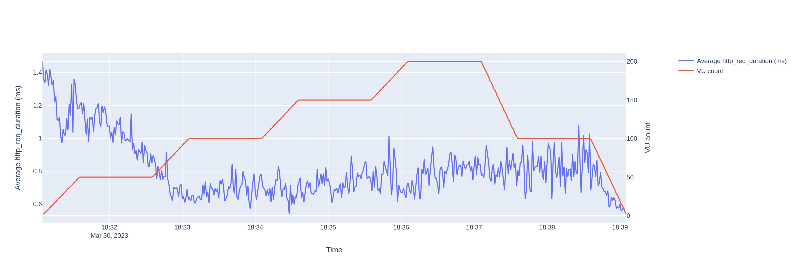

### Fiber (Go)

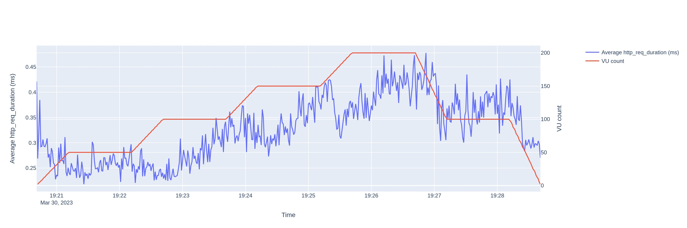

### expressjs (Node)

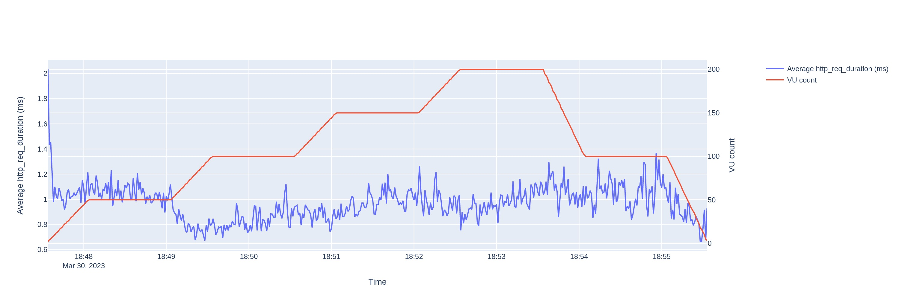

### Flask (Python)

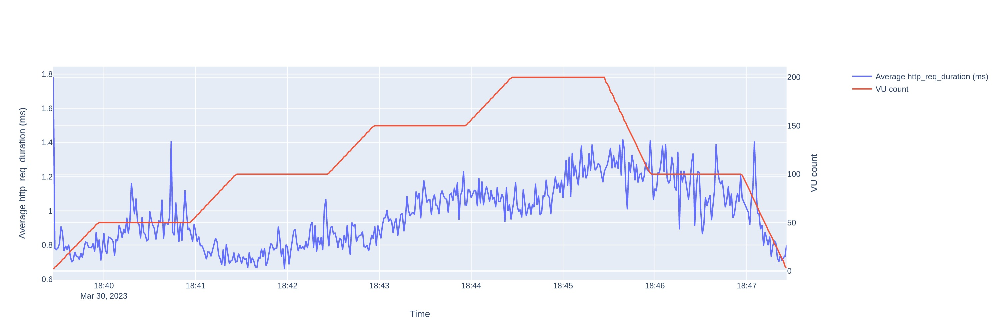
